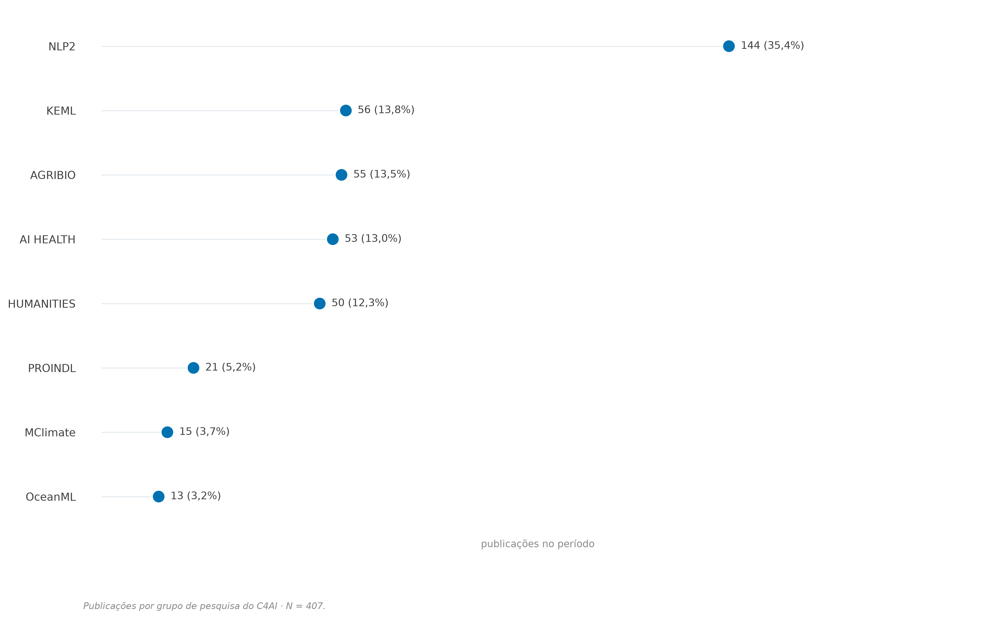
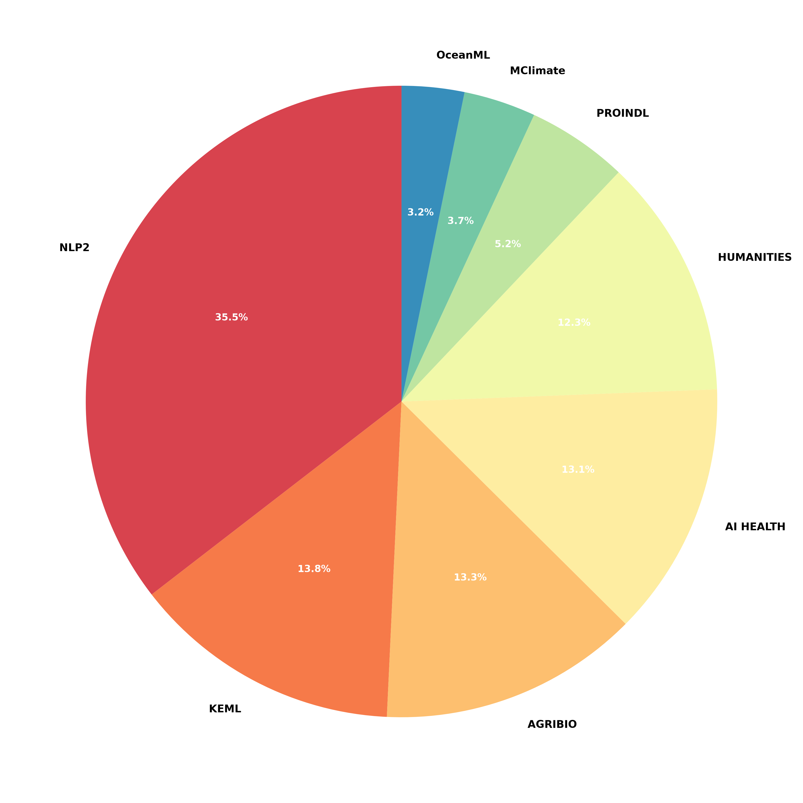
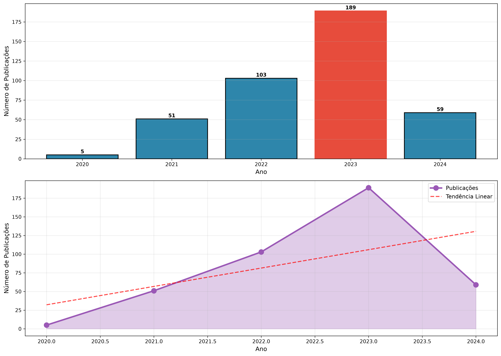
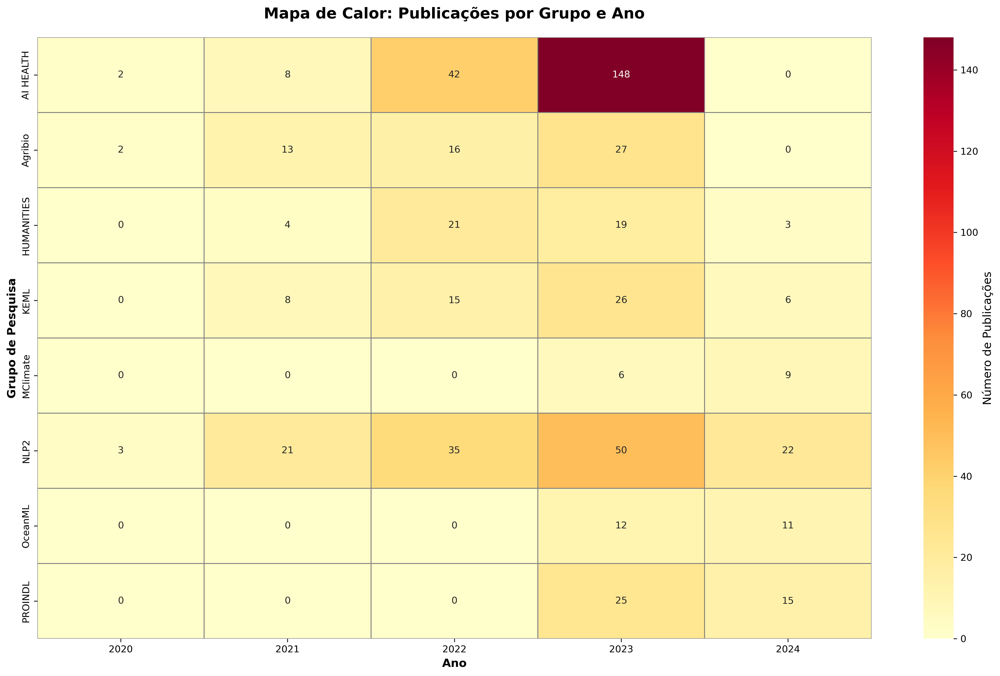
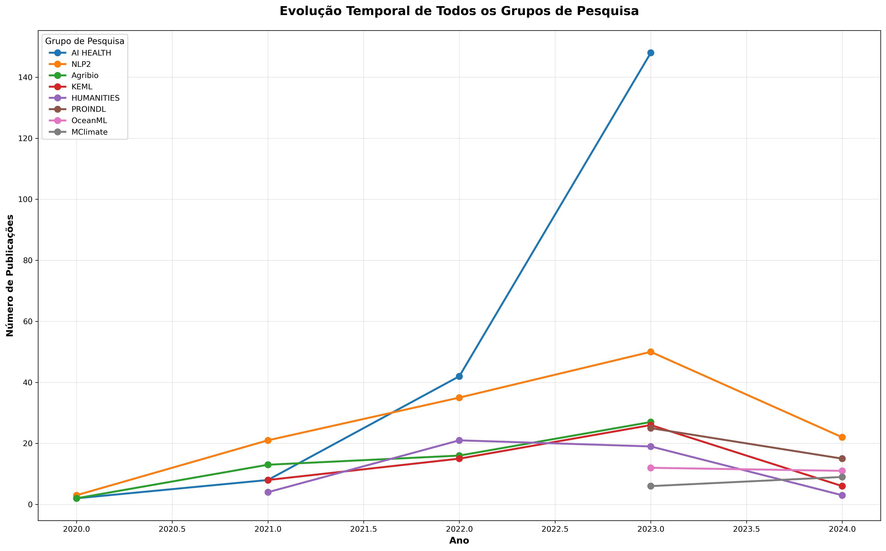
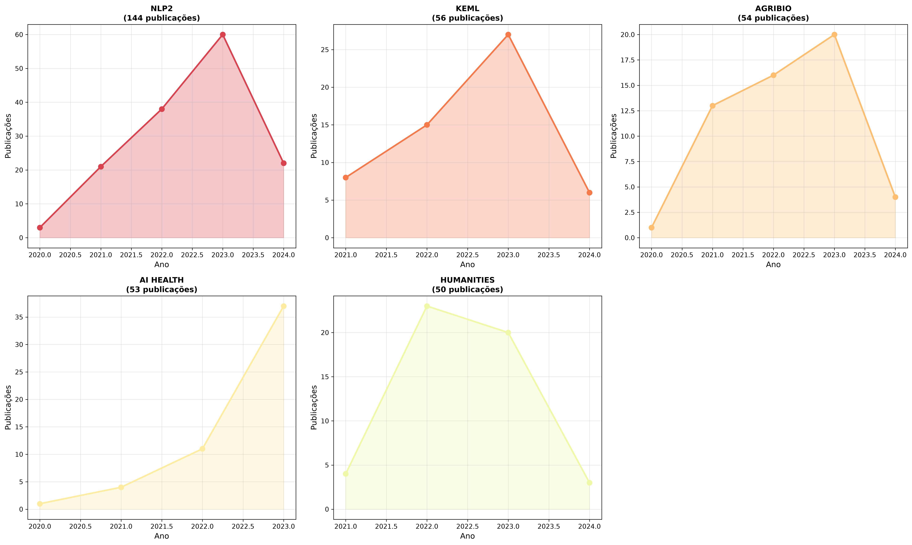
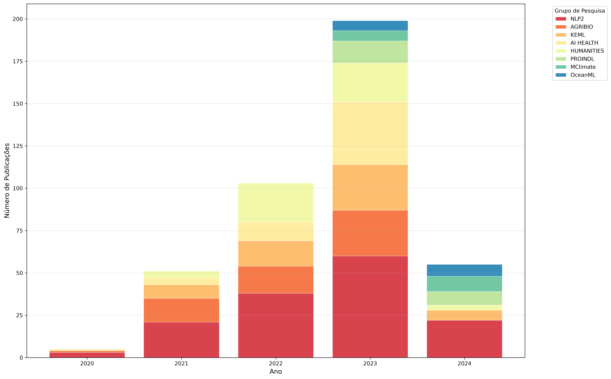
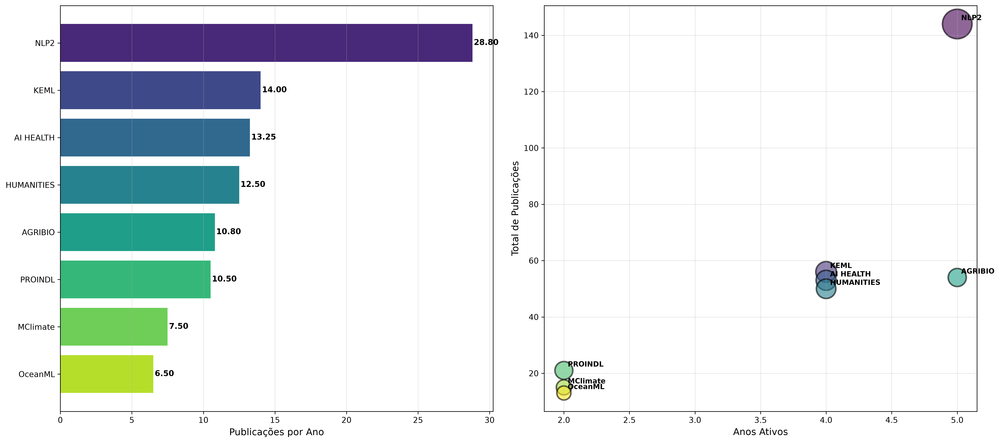
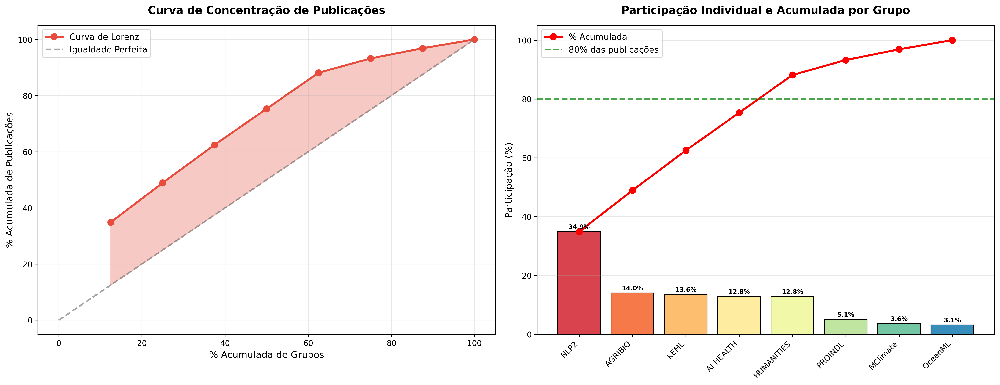

# Análise Bibliométrica da Produção Acadêmica do C4AI

**Centro de Inteligência Artificial da Universidade de São Paulo** (USP · FAPESP · IBM)
Período analisado: **2020–2024**

---

## Resumo

Análise bibliométrica exploratória da produção acadêmica dos oito grupos de pesquisa que compõem o **C4AI**: Agribio, AI HEALTH, KEML, MClimate, NLP2, OceanML, PROINDL e HUMANITIES. Os dados foram coletados automaticamente da base de publicações oficial do centro (<https://c4ai.inova.usp.br/resources.html>) e, após limpeza e desduplicação, contabilizaram **413 publicações** no período de **2020 a 2024**.

As análises abrangem o *ranking* e a distribuição proporcional por grupo, a evolução temporal agregada e por grupo, a taxa de produtividade (publicações por ano) e indicadores de concentração da produção (índice Herfindahl–Hirschman, HHI). Os resultados indicam uma produção **moderadamente concentrada** — os três maiores grupos respondem por **62,5%** de todas as publicações — com pico de produção em **2023** (199 publicações) e liderança consolidada do grupo **NLP2**.

---

## 1. Introdução e metodologia

A análise consolida as publicações dos grupos de pesquisa do C4AI em um único conjunto de dados limpo. Os registros foram obtidos diretamente da fonte de dados que alimenta a página de recursos do centro — um arquivo **CSV** carregado dinamicamente pela aplicação web —, garantindo cobertura completa e reprodutível da base. Após a normalização das colunas (`Grupo`, `Ano`, `Título`, `Autores`), a consolidação das variantes de rótulo de um mesmo grupo e a remoção de registros inválidos, restaram **413 publicações** distribuídas entre **8 grupos** no intervalo de 2020 a 2024. As métricas e visualizações foram geradas com as bibliotecas `pandas`, `matplotlib` e `seaborn`.

**Procedência e tratamento dos dados.** A coleta é realizada pelo *script* `scrape_c4ai.py`, que acessa o arquivo `resources/publicacoes.csv` (delimitado por ponto e vírgula), remove a marcação HTML embutida nos campos textuais e exporta os dados no formato esperado pela rotina de análise. Dois cuidados de qualidade foram adotados:

1. O grupo de saúde, registrado na base sob três grafias distintas (`AI HEALTH`, `AL HEALTH` e `HEALTH`), foi consolidado sob o rótulo único **AI HEALTH**.
2. A exportação grava cada publicação uma única vez, evitando a dupla contagem.

Esse tratamento explica por que o total aqui reportado (413) é inferior a contagens anteriores baseadas em coletas manuais: estas continham registros duplicados que inflavam artificialmente os volumes, sobretudo no grupo AI HEALTH.

### Tabela 1 — Indicadores gerais

| Indicador | Valor |
|---|---|
| Total de publicações | 413 |
| Período analisado | 2020–2024 |
| Número de grupos de pesquisa | 8 |
| Média geral de publicações por ano | 82,6 |
| Ano mais produtivo | 2023 (199 pubs) |
| Grupo mais produtivo (total) | NLP2 (144 pubs) |
| Grupo mais eficiente (pubs/ano) | NLP2 (28,80) |
| Concentração nos 3 maiores grupos | 62,5% |
| Índice de concentração HHI | 1975 (moderado) |

### Tabela 2 — Ranking dos grupos

| # | Grupo | Total | Part. (%) | Pubs/ano |
|---|---|---|---|---|
| 1 | NLP2 | 144 | 34,9 | 28,80 |
| 2 | AGRIBIO | 58 | 14,0 | 14,50 |
| 3 | KEML | 56 | 13,6 | 14,00 |
| 4 | AI HEALTH | 53 | 12,8 | 13,25 |
| 5 | HUMANITIES | 53 | 12,8 | 13,25 |
| 6 | PROINDL | 21 | 5,1 | 10,50 |
| 7 | MClimate | 15 | 3,6 | 7,50 |
| 8 | OceanML | 13 | 3,1 | 6,50 |
| | **Total** | **413** | **100,0** | — |

---

## 2. Inventário de figuras

As nove figuras a seguir foram geradas automaticamente pelo *script* `analise_publicacoes` e estão disponíveis em alta resolução nas pastas [`figuras/`](figuras/) e [`output/`](output/).

| # | Arquivo | Tipo de visualização | Seção |
|---|---|---|---|
| 1 | `1_ranking_grupos.png` | Barras horizontais (ranking) | Distribuição por grupo |
| 2 | `2_pizza_grupos.png` | Gráfico de setores (pizza) | Distribuição por grupo |
| 3 | `3_evolucao_temporal_geral.png` | Barras + linha de tendência | Evolução temporal |
| 4 | `4_heatmap_grupo_ano.png` | Mapa de calor (grupo × ano) | Evolução temporal |
| 5 | `5_evolucao_todos_grupos.png` | Linhas sobrepostas | Evolução temporal |
| 6 | `6_produtividade_grupos.png` | Barras + dispersão (2 painéis) | Produtividade |
| 7 | `7_comparacao_top_grupos.png` | *Small multiples* (linhas) | Evolução temporal |
| 8 | `8_composicao_temporal.png` | Barras empilhadas | Evolução temporal |
| 9 | `9_analise_concentracao.png` | Curva de Lorenz + participação | Concentração |

---

## 3. Distribuição da produção por grupo

### Figura 1 — Ranking de publicações por grupo

**Ranking de publicações por grupo de pesquisa do C4AI.** Gráfico de barras horizontais ordenado de forma decrescente pelo número absoluto de publicações. O grupo **NLP2** lidera com 144 publicações (34,9% do total), seguido por **AGRIBIO** com 58 (14,0%) e **KEML** com 56 (13,6%). Na sequência aparecem AI HEALTH e HUMANITIES, empatados com 53 publicações (12,8% cada), e os grupos de menor volume — PROINDL (21; 5,1%), MClimate (15; 3,6%) e OceanML (13; 3,1%). A liderança isolada de NLP2 evidencia a assimetria da produção entre os grupos.

### Figura 2 — Distribuição proporcional por grupo

**Distribuição proporcional de publicações por grupo.** O gráfico de setores reforça a leitura do ranking (Figura 1), destacando que **NLP2**, sozinho, responde por cerca de um terço da produção (34,9%) e que os dois maiores grupos (NLP2 e AGRIBIO) somam 48,9%. As fatias dos grupos intermediários (KEML, AI HEALTH, HUMANITIES) e dos três menores (PROINDL, MClimate, OceanML) revelam uma distribuição desigual, porém menos concentrada do que a sugerida por coletas anteriores não desduplicadas.

---

## 4. Evolução temporal da produção

### Figura 3 — Evolução anual e tendência de crescimento

**Evolução anual de publicações e tendência de crescimento do C4AI.** *Painel superior:* número absoluto de publicações por ano, com o ano de pico (**2023**, 199 publicações) destacado em vermelho. Observa-se o crescimento acelerado de 2020 (5) a 2023, passando por 51 em 2021 e 103 em 2022, seguido de queda acentuada em 2024 (55). *Painel inferior:* a mesma série com a curva de *tendência linear* (linha tracejada vermelha) sobreposta; a tendência permanece positiva, mas a queda de 2024 sugere um possível artefato de coleta incompleta dos dados desse ano, e não necessariamente uma redução real da produção.

### Figura 4 — Mapa de calor grupo × ano

**Mapa de calor: publicações por grupo e ano.** Cada célula indica o número de publicações de um grupo em um determinado ano; a intensidade da cor é proporcional ao volume. A célula mais intensa corresponde a **NLP2 em 2023** (60 publicações), responsável por boa parte do pico geral observado na Figura 3. O mapa também revela a entrada mais tardia de alguns grupos — MClimate, OceanML e PROINDL só registram publicações a partir de 2023 —, enquanto NLP2 mantém produção em todo o período e AI HEALTH concentra sua produção em 2023 (37 publicações), sem registros em 2024.

### Figura 5 — Evolução temporal de todos os grupos

**Evolução temporal de todos os grupos de pesquisa.** Séries anuais sobrepostas para os oito grupos. Destaca-se a trajetória de **NLP2** (com pico de 60 publicações em 2023), consistentemente acima das demais ao longo de todo o período, em contraste com as trajetórias mais estáveis ou de entrada recente dos outros grupos. A convergência das linhas em 2024 reflete tanto a maturação dos grupos menores quanto a já mencionada provável incompletude dos dados do último ano.

### Figura 7 — Evolução temporal dos principais grupos

**Evolução temporal dos cinco principais grupos.** Painéis individuais (*small multiples*) com a série anual de cada um dos cinco grupos mais produtivos, permitindo comparar perfis de crescimento sem a sobreposição da Figura 5. NLP2 (144 pubs) apresenta crescimento sustentado e o maior volume em todos os anos; AGRIBIO (58 pubs) cresce de forma gradual até 2023; KEML (56) e AI HEALTH (53) exibem perfis em forma de pico, com máximo em 2023; e HUMANITIES (53) concentra sua produção em 2022–2023.

### Figura 8 — Composição temporal empilhada

**Composição de publicações por grupo ao longo do tempo.** Barras empilhadas que decompõem o total anual segundo a contribuição de cada grupo. Além de confirmar o pico de 2023, o gráfico evidencia a composição da produção: **NLP2** mantém-se como a maior contribuição individual em praticamente todos os anos, enquanto grupos como AI HEALTH, KEML e HUMANITIES ganham peso a partir de 2022–2023, e os grupos de entrada recente (MClimate, OceanML, PROINDL) passam a compor o volume anual apenas nos dois últimos anos.

---

## 5. Produtividade e concentração

### Figura 6 — Taxa de produtividade por grupo

**Taxa de produtividade e relação produção × tempo de atividade.** *Painel esquerdo:* taxa de produtividade (publicações por ano de atividade) por grupo; NLP2 lidera com 28,80 pubs/ano, seguido por AGRIBIO (14,50) e KEML (14,00). *Painel direito:* dispersão entre o número de anos ativos (eixo *x*) e o total de publicações (eixo *y*), em que o tamanho de cada círculo é proporcional à taxa de produtividade. Grupos como PROINDL alcançam produtividade relativamente alta (10,50 pubs/ano) apesar do curto período de atividade (apenas 2023–2024), enquanto NLP2 combina longevidade (5 anos ativos) e volume elevado.

### Índice de concentração (HHI)

O grau de concentração da produção foi quantificado pelo índice Herfindahl–Hirschman (HHI), definido como a soma dos quadrados das participações percentuais de cada grupo:

$$\mathrm{HHI} = \sum_{i=1}^{n} s_i^{2} \times 10\,000, \qquad s_i = \frac{\text{publicações do grupo } i}{\text{total de publicações}}.$$

O valor obtido foi de **HHI ≈ 1975**, situado na faixa *moderada* (1500 a 2500). Esse resultado é coerente com a observação de que os três maiores grupos concentram 62,5% da produção total, configurando um cenário de produção desigual, porém ainda não plenamente monopolizado por um único grupo.

### Figura 9 — Análise de concentração da produção

**Análise de concentração da produção: curva de Lorenz e participação acumulada.** *Painel esquerdo:* curva de Lorenz (linha vermelha) comparada à linha de igualdade perfeita (tracejada); o afastamento entre as curvas mede a desigualdade da distribuição de publicações entre os grupos. *Painel direito:* participação individual (barras) e acumulada (linha vermelha) de cada grupo, com a referência de 80% (linha verde). Os quatro maiores grupos (NLP2, AGRIBIO, KEML e AI HEALTH) já ultrapassam 75% do total, ilustrando graficamente a concentração moderada captada pelo índice HHI.

---

## 6. Considerações finais

A produção acadêmica do C4AI no período 2020–2024 caracteriza-se por:

- **Concentração moderada:** NLP2 e AGRIBIO respondem por 48,9% das publicações; os três maiores grupos (NLP2, AGRIBIO e KEML), por 62,5% (HHI moderado ≈ 1975).
- **Liderança de NLP2:** o grupo é o mais produtivo tanto em volume total (144 publicações) quanto em taxa anual (28,80 pubs/ano), mantendo produção em todos os anos do período.
- **Crescimento acelerado até 2023:** o volume anual saltou de 5 publicações em 2020 para 199 em 2023, com participação crescente dos grupos de saúde, conhecimento e humanidades.
- **Queda aparente em 2024:** provavelmente associada à coleta incompleta dos dados do último ano, o que recomenda cautela na interpretação dessa redução.
- **Heterogeneidade de trajetórias:** convivem grupos de crescimento sustentado (NLP2, AGRIBIO) com grupos de entrada recente e produção concentrada em poucos anos (MClimate, OceanML, PROINDL).

**Nota sobre a revisão dos dados.** Os números deste relatório resultam de uma coleta automatizada e desduplicada da base oficial do C4AI. Versões anteriores, baseadas em coleta manual, reportavam 569 publicações e atribuíam a liderança ao grupo AI HEALTH (200 publicações); a investigação mostrou que esses valores estavam inflados por 170 registros duplicados — concentrados sobretudo no grupo AI HEALTH, que após a desduplicação totaliza 53 publicações. Os indicadores aqui apresentados, portanto, substituem e corrigem as estimativas anteriores.

---

*As figuras e os indicadores foram gerados automaticamente pelo script de análise (`analise_publicacoes`) a partir do arquivo de dados consolidado pelo script de coleta (`scrape_c4ai.py`). A versão tipografada deste relatório está disponível em [`documento_analise.tex`](documento_analise.tex).*
