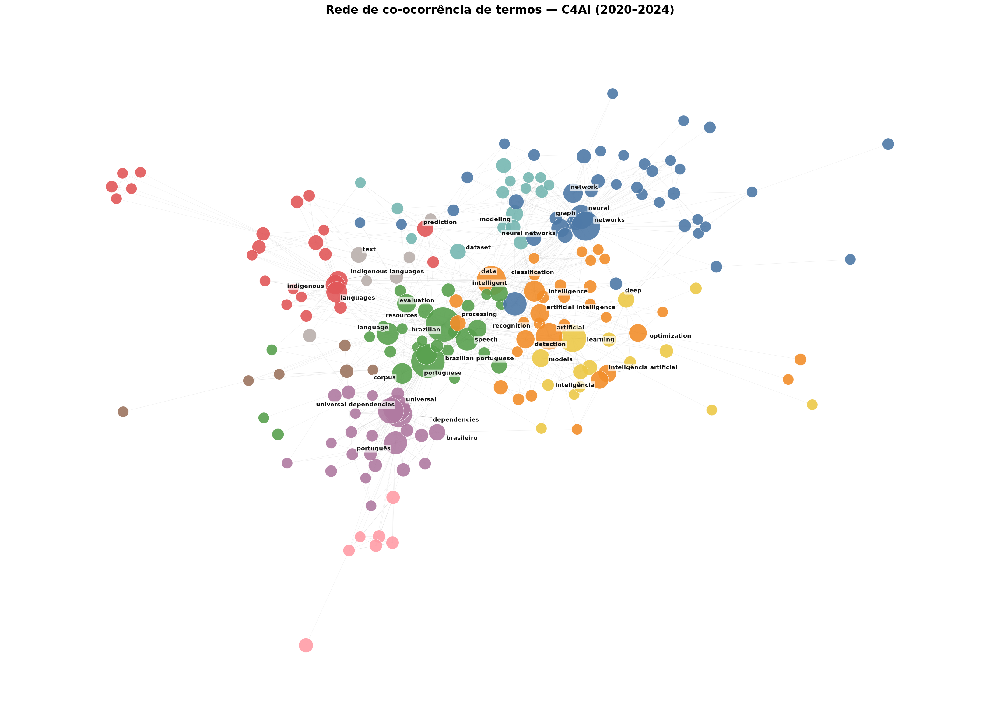
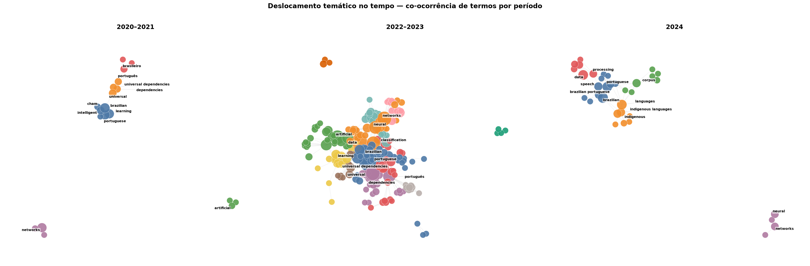

# Análise Bibliométrica da Produção Acadêmica do C4AI

**Centro de Inteligência Artificial da Universidade de São Paulo** (USP · FAPESP · IBM)
Período analisado: **2020–2024**

---

## Resumo

Análise bibliométrica exploratória da produção acadêmica dos oito grupos de pesquisa que compõem o **C4AI**: AGRIBIO, AI HEALTH, KEML, MClimate, NLP2, OceanML, PROINDL e HUMANITIES. Os dados provêm de uma **curadoria manual** da produção do centro, revisada e desduplicada pela pesquisadora, totalizando **407 publicações** no período de **2020 a 2024**.

As análises abrangem o *ranking* e a distribuição proporcional por grupo, a evolução temporal agregada e por grupo, a taxa de produtividade (publicações por ano), indicadores de concentração da produção (índice Herfindahl–Hirschman, HHI) e uma **análise de co-ocorrência de termos** (*co-word analysis*). Os resultados indicam uma produção **moderadamente concentrada** — os três maiores grupos respondem por **62,7%** de todas as publicações — com pico de produção em **2023** (189 publicações) e liderança consolidada do grupo **NLP2**.

---

## 1. Introdução e metodologia

A análise consolida as publicações dos grupos de pesquisa do C4AI em um único conjunto de dados limpo. A fonte é uma planilha de **curadoria manual** mantida pela pesquisadora (`c4ai_publicacoes_manual.xlsx`), na qual cada registro traz, em colunas separadas, o grupo de pesquisa, o tipo de publicação, os autores, o título e o ano. Diferentemente de uma coleta automatizada, essa curadoria mantém os **títulos limpos** (sem listas de autores ou metadados de *venue* embutidos), o que beneficia tanto a leitura bibliométrica quanto a co-word analysis.

**Preparação dos dados.** O *script* `preparar_base.py` normaliza a planilha de curadoria para o schema canônico (`c4ai_publicacoes.xlsx`), aplicando dois cuidados de qualidade:

1. O grupo de saúde, registrado sob as grafias `AI HEALTH`, `AL HEALTH` e `HEALTH`, foi consolidado sob o rótulo único **AI HEALTH**.
2. Dois registros cujo rótulo de grupo havia ficado deslocado (recebendo o valor da coluna *tipo*) foram corrigidos para **AGRIBIO**, conforme seus autores e temas.

Restaram **407 publicações** distribuídas entre **8 grupos**, todas com ano de publicação identificado (2020–2024). As métricas e visualizações foram geradas com `pandas`, `matplotlib`, `seaborn` e `networkx`.

### Tabela 1 — Indicadores gerais

| Indicador | Valor |
|---|---|
| Total de publicações | 407 |
| Período analisado | 2020–2024 |
| Número de grupos de pesquisa | 8 |
| Média geral de publicações por ano | 81,4 |
| Ano mais produtivo | 2023 (189 pubs) |
| Grupo mais produtivo (total) | NLP2 (144 pubs) |
| Grupo mais eficiente (pubs/ano) | NLP2 (28,80) |
| Concentração nos 3 maiores grupos | 62,7% |
| Índice de concentração HHI | 1995 (moderado) |

### Tabela 2 — Ranking dos grupos

| # | Grupo | Total | Part. (%) | Pubs/ano |
|---|---|---|---|---|
| 1 | NLP2 | 144 | 35,4 | 28,80 |
| 2 | KEML | 56 | 13,8 | 14,00 |
| 3 | AGRIBIO | 55 | 13,5 | 11,00 |
| 4 | AI HEALTH | 53 | 13,0 | 13,25 |
| 5 | HUMANITIES | 50 | 12,3 | 12,50 |
| 6 | PROINDL | 21 | 5,2 | 10,50 |
| 7 | MClimate | 15 | 3,7 | 7,50 |
| 8 | OceanML | 13 | 3,2 | 6,50 |
| | **Total** | **407** | **100,0** | — |

---

## 2. Inventário de figuras

As figuras a seguir foram geradas automaticamente e estão disponíveis em alta resolução nas pastas [`figuras/`](figuras/) e [`output/`](output/). As figuras 1–9 vêm do *script* `analise_publicacoes`; as figuras 10–11 (co-word analysis) vêm de `coword_analysis.py`.

| # | Arquivo | Tipo de visualização | Seção |
|---|---|---|---|
| 1 | `1_ranking_grupos.png` | Barras horizontais (ranking) | Distribuição por grupo |
| 2 | `2_pizza_grupos.png` | Gráfico de setores (pizza) | Distribuição por grupo |
| 3 | `3_evolucao_temporal_geral.png` | Barras + linha de tendência | Evolução temporal |
| 4 | `4_heatmap_grupo_ano.png` | Mapa de calor (grupo × ano) | Evolução temporal |
| 5 | `5_evolucao_todos_grupos.png` | Linhas sobrepostas | Evolução temporal |
| 6 | `6_produtividade_grupos.png` | Barras + dispersão (2 painéis) | Produtividade |
| 7 | `7_comparacao_top_grupos.png` | *Small multiples* (linhas) | Evolução temporal |
| 8 | `8_composicao_temporal.png` | Barras empilhadas | Evolução temporal |
| 9 | `9_analise_concentracao.png` | Curva de Lorenz + participação | Concentração |
| 10 | `10_rede_coword.png` | Rede de co-ocorrência (comunidades) | Co-word analysis |
| 11 | `11_rede_coword_temporal.png` | *Small multiples* de redes por período | Co-word analysis |

---

## 3. Distribuição da produção por grupo

### Figura 1 — Ranking de publicações por grupo

**Ranking de publicações por grupo de pesquisa do C4AI.** Gráfico de barras horizontais ordenado de forma decrescente pelo número absoluto de publicações. O grupo **NLP2** lidera com 144 publicações (35,4% do total), seguido por **KEML** com 56 (13,8%) e **AGRIBIO** com 55 (13,5%). Na sequência aparecem AI HEALTH com 53 (13,0%) e HUMANITIES com 50 (12,3%), e os grupos de menor volume — PROINDL (21; 5,2%), MClimate (15; 3,7%) e OceanML (13; 3,2%). A liderança isolada de NLP2 evidencia a assimetria da produção entre os grupos.

### Figura 2 — Distribuição proporcional por grupo

**Distribuição proporcional de publicações por grupo.** O gráfico de setores reforça a leitura do ranking (Figura 1), destacando que **NLP2**, sozinho, responde por cerca de um terço da produção (35,4%) e que os dois maiores grupos (NLP2 e KEML) somam 49,1%. As fatias dos grupos intermediários (AGRIBIO, AI HEALTH, HUMANITIES) e dos três menores (PROINDL, MClimate, OceanML) revelam uma distribuição desigual, porém não monopolizada por um único grupo.

---

## 4. Evolução temporal da produção

### Figura 3 — Evolução anual e tendência de crescimento

**Evolução anual de publicações e tendência de crescimento do C4AI.** *Painel superior:* número absoluto de publicações por ano, com o ano de pico (**2023**, 189 publicações) destacado em vermelho. Observa-se o crescimento acelerado de 2020 (5) a 2023, passando por 51 em 2021 e 103 em 2022, seguido de queda acentuada em 2024 (59). *Painel inferior:* a mesma série com a curva de *tendência linear* (linha tracejada vermelha) sobreposta; a tendência permanece positiva, mas a queda de 2024 sugere um possível artefato de coleta incompleta dos dados desse ano, e não necessariamente uma redução real da produção.

### Figura 4 — Mapa de calor grupo × ano

**Mapa de calor: publicações por grupo e ano.** Cada célula indica o número de publicações de um grupo em um determinado ano; a intensidade da cor é proporcional ao volume. A célula mais intensa corresponde a **NLP2 em 2023** (60 publicações), responsável por boa parte do pico geral observado na Figura 3. O mapa também revela a entrada mais tardia de alguns grupos — MClimate, OceanML e PROINDL só registram publicações a partir de 2023 —, enquanto NLP2 mantém produção em todo o período e AI HEALTH concentra sua produção em 2023 (37 publicações), sem registros em 2024.

### Figura 5 — Evolução temporal de todos os grupos

**Evolução temporal de todos os grupos de pesquisa.** Séries anuais sobrepostas para os oito grupos. Destaca-se a trajetória de **NLP2** (com pico de 60 publicações em 2023), consistentemente acima das demais ao longo de todo o período, em contraste com as trajetórias mais estáveis ou de entrada recente dos outros grupos. A convergência das linhas em 2024 reflete tanto a maturação dos grupos menores quanto a já mencionada provável incompletude dos dados do último ano.

### Figura 7 — Evolução temporal dos principais grupos

**Evolução temporal dos cinco principais grupos.** Painéis individuais (*small multiples*) com a série anual de cada um dos cinco grupos mais produtivos, permitindo comparar perfis de crescimento sem a sobreposição da Figura 5. NLP2 (144 pubs) apresenta crescimento sustentado e o maior volume em todos os anos; KEML (56) e AGRIBIO (55) crescem de forma gradual até 2023; AI HEALTH (53) exibe perfil em forma de pico, com máximo em 2023; e HUMANITIES (50) concentra sua produção em 2022–2023.

### Figura 8 — Composição temporal empilhada

**Composição de publicações por grupo ao longo do tempo.** Barras empilhadas que decompõem o total anual segundo a contribuição de cada grupo. Além de confirmar o pico de 2023, o gráfico evidencia a composição da produção: **NLP2** mantém-se como a maior contribuição individual em praticamente todos os anos, enquanto grupos como AI HEALTH, KEML e HUMANITIES ganham peso a partir de 2022–2023, e os grupos de entrada recente (MClimate, OceanML, PROINDL) passam a compor o volume anual apenas nos dois últimos anos.

---

## 5. Produtividade e concentração

### Figura 6 — Taxa de produtividade por grupo

**Taxa de produtividade e relação produção × tempo de atividade.** *Painel esquerdo:* taxa de produtividade (publicações por ano de atividade) por grupo; NLP2 lidera com 28,80 pubs/ano, seguido por KEML (14,00) e AI HEALTH (13,25). *Painel direito:* dispersão entre o número de anos ativos (eixo *x*) e o total de publicações (eixo *y*), em que o tamanho de cada círculo é proporcional à taxa de produtividade. Grupos como PROINDL alcançam produtividade relativamente alta (10,50 pubs/ano) apesar do curto período de atividade (apenas 2023–2024), enquanto NLP2 combina longevidade (5 anos ativos) e volume elevado.

### Índice de concentração (HHI)

O grau de concentração da produção foi quantificado pelo índice Herfindahl–Hirschman (HHI), definido como a soma dos quadrados das participações percentuais de cada grupo:

$$\mathrm{HHI} = \sum_{i=1}^{n} s_i^{2} \times 10\,000, \qquad s_i = \frac{\text{publicações do grupo } i}{\text{total de publicações}}.$$

O valor obtido foi de **HHI ≈ 1995**, situado na faixa *moderada* (1500 a 2500). Esse resultado é coerente com a observação de que os três maiores grupos concentram 62,7% da produção total, configurando um cenário de produção desigual, porém ainda não plenamente monopolizado por um único grupo.

### Figura 9 — Análise de concentração da produção

**Análise de concentração da produção: curva de Lorenz e participação acumulada.** *Painel esquerdo:* curva de Lorenz (linha vermelha) comparada à linha de igualdade perfeita (tracejada); o afastamento entre as curvas mede a desigualdade da distribuição de publicações entre os grupos. *Painel direito:* participação individual (barras) e acumulada (linha vermelha) de cada grupo, com a referência de 80% (linha verde). Os quatro maiores grupos (NLP2, KEML, AGRIBIO e AI HEALTH) já ultrapassam 75% do total, ilustrando graficamente a concentração moderada captada pelo índice HHI.

---

## 6. Análise de co-ocorrência de termos (co-word analysis)

Esta seção pratica a *co-word analysis* no espírito do método clássico de Callon, Law & Rip (rede de palavras / rede de problematizações): extraem-se os termos das publicações, calcula-se a co-ocorrência entre eles e mapeia-se como os temas se **agrupam** (comunidades) e se **deslocam no tempo**. A rede é gerada pelo script [`coword_analysis.py`](coword_analysis.py).

**Fonte dos termos.** A base de curadoria manual traz o `Título` (mas não *abstracts* nem palavras-chave). Os termos desta análise são, portanto, extraídos dos **títulos** das 407 publicações, após limpeza de eventual "rabo" bibliográfico (venue, periódico, volume, páginas) e remoção de *stopwords* bilíngues (PT/EN) e de ruído editorial. É uma aproximação honesta: o sinal é mais esparso que o de uma co-word baseada em *keywords*. Para uma versão mais fiel, o script [`enrich_metadata.py`](enrich_metadata.py) busca *abstracts* e *keywords* no OpenAlex; basta apontar `coword_analysis.py --input` para o arquivo enriquecido.

### Figura 10 — Rede global de co-ocorrência de termos

**Rede de co-ocorrência de termos — C4AI (2020–2024).** Cada nó é um termo (uni ou bigrama) presente nos títulos; o tamanho é proporcional à frequência e a cor indica a comunidade temática detectada pelo algoritmo de Louvain. Duas palavras se ligam quando co-ocorrem no mesmo título. Emergem agrupamentos coerentes que espelham os grupos de pesquisa: **PLN do português brasileiro** (*brazilian portuguese, speech, corpus, recognition*), **dependências universais** (*universal dependencies, brasileiro*), **aprendizado de máquina e profundo** (*machine/deep learning, benchmark, covid*), **redes neurais, classificação e grafos** (*neural networks, classification, graph, ocean*), **IA, dados e otimização** (*artificial intelligence, detection, optimization*), **clima** (*climate change, modeling, variables*), **línguas indígenas e impacto ético-social** (*indigenous languages, ethical, impact*) e um agrupamento emergente de **mercado financeiro** (*mercado financeiro, tweets*).

### Figura 11 — Deslocamento temático no tempo

**Deslocamento temático no tempo — co-ocorrência por período.** A mesma rede, recortada em três janelas (2020–2021, 2022–2023 e 2024), evidencia o movimento dos problemas: em **2020–2021** o mapa é esparso e ancorado em PLN do português e dependências universais; em **2022–2023** — o pico de produção — a rede se adensa e se diversifica, incorporando aprendizado de máquina, clima e saúde; em **2024** a rede se contrai (coleta provavelmente incompleta do último ano). Esse movimento ilustra graficamente como as problematizações do centro se agrupam e migram ao longo do período.

**Saídas geradas** (em `output/coword/`): além das duas figuras, o script produz uma **rede interativa navegável** (`rede_coword_interativa.html`) e três tabelas — lista de arestas (`coword_arestas.xlsx`), termos por comunidade (`coword_nos_comunidades.xlsx`) e termos por período (`coword_termos_por_periodo.xlsx`).

> **Nota metodológica.** Por se basear em títulos, esta rede capta a co-ocorrência lexical da produção, não o conteúdo integral dos trabalhos; termos genéricos de *venue* e método foram filtrados, mas alguma esparsidade é inerente. A leitura interpretativa das "problematizações" (no sentido do livro) permanece a cargo do/a pesquisador/a — a rede é um instrumento exploratório, não um substituto da análise qualitativa.

---

## 7. Considerações finais

A produção acadêmica do C4AI no período 2020–2024 caracteriza-se por:

- **Concentração moderada:** NLP2 e KEML respondem por 49,1% das publicações; os três maiores grupos (NLP2, KEML e AGRIBIO), por 62,7% (HHI moderado ≈ 1995).
- **Liderança de NLP2:** o grupo é o mais produtivo tanto em volume total (144 publicações) quanto em taxa anual (28,80 pubs/ano), mantendo produção em todos os anos do período.
- **Crescimento acelerado até 2023:** o volume anual saltou de 5 publicações em 2020 para 189 em 2023, com participação crescente dos grupos de saúde, conhecimento e humanidades.
- **Queda aparente em 2024:** provavelmente associada à coleta incompleta dos dados do último ano, o que recomenda cautela na interpretação dessa redução.
- **Heterogeneidade de trajetórias:** convivem grupos de crescimento sustentado (NLP2, KEML, AGRIBIO) com grupos de entrada recente e produção concentrada em poucos anos (MClimate, OceanML, PROINDL).

**Nota sobre a procedência dos dados.** Os números deste relatório resultam da **curadoria manual** da produção do centro, revisada e desduplicada pela pesquisadora (407 publicações). Uma coleta manual anterior reportava 569 publicações e atribuía a liderança ao grupo AI HEALTH (200 publicações); esses valores estavam inflados por registros duplicados — sobretudo no grupo de saúde, que após a desduplicação totaliza 53 publicações. Uma coleta automatizada da base oficial (`scrape_c4ai.py`) produziu, de forma independente, um total próximo (413), o que corrobora a ordem de grandeza adotada. A base de curadoria manual foi escolhida como fonte oficial por manter os títulos limpos, beneficiando a co-word analysis.

---

*As figuras e os indicadores foram gerados automaticamente pelo script `analise_publicacoes` (Figuras 1–9) e pelo `coword_analysis.py` (Figuras 10–11), a partir da base canônica `c4ai_publicacoes.xlsx`, normalizada por `preparar_base.py` sobre a planilha de curadoria manual. A versão tipografada deste relatório está disponível em [`documento_analise.tex`](documento_analise.tex).*
